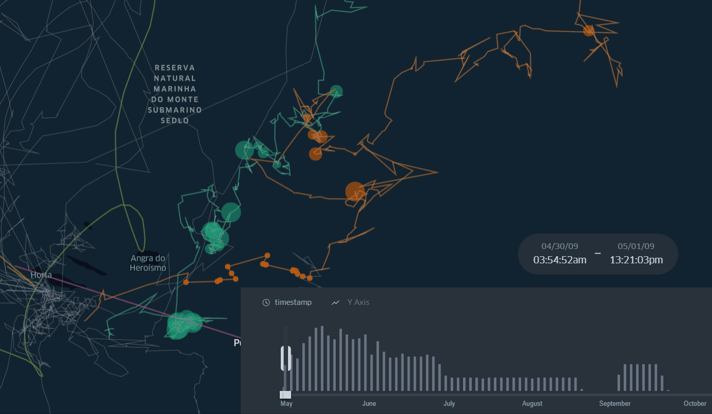

# Foraging spots detection in Great Whale's migration routes

# Summary
This demo contains the Foraging Spots of Great Whale's migration routes with a time filter of 2009 in North Atlantic Ocean. 

***Final map animation:*** https://bryanvallejo16.github.io/whale-tracking-azores-II/

***Tutorial:*** https://towardsdatascience.com/foraging-spots-detection-in-great-whales-migration-routes-19ee4540930e

# Map animation 

